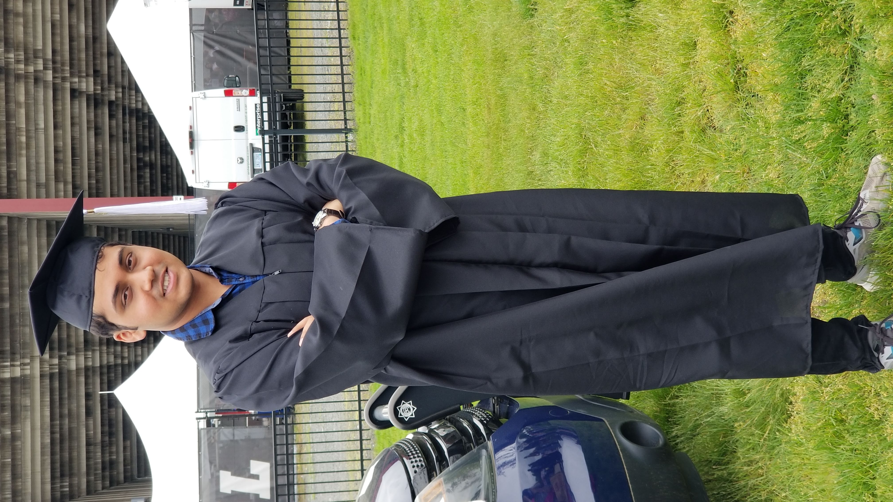

## Introduction

Hi! My name is Sriharsha Ayyagary. I'm a master's student at the University of Helsinki, in the language technology track of the LingDig program. I am interested in geography, trivia, movies, gaming, traveling, and language learning. 

## Find me on

[LinkedIn](https://www.linkedin.com/in/sriharsha-ayyagary-090103b), [GitHub](https://github.com/sriharshaahelsinki)

## Contact

My email address is sriharsha.ayyagary@helsinki.fi. 

## Courses I've Taken

[Command Line Tools](https://studies.helsinki.fi/courses/course-implementation/hy-opt-cur-2425-261401a1-c550-4436-91b9-7edf4a1a3b57/KIK-LG221), fall 2024

[Anthropological Linguistics](https://studies.helsinki.fi/courses/course-implementation/hy-opt-cur-2425-7243d4c7-b350-45af-a4b1-6ea9a041b1a5/KIM-KY338), fall 2024

## Projects
[Github Project](https://github.com/sriharshaahelsinki/cmdline-course)
## Misc. 

[Letterboxd](https://letterboxd.com/blaze20k/) 
